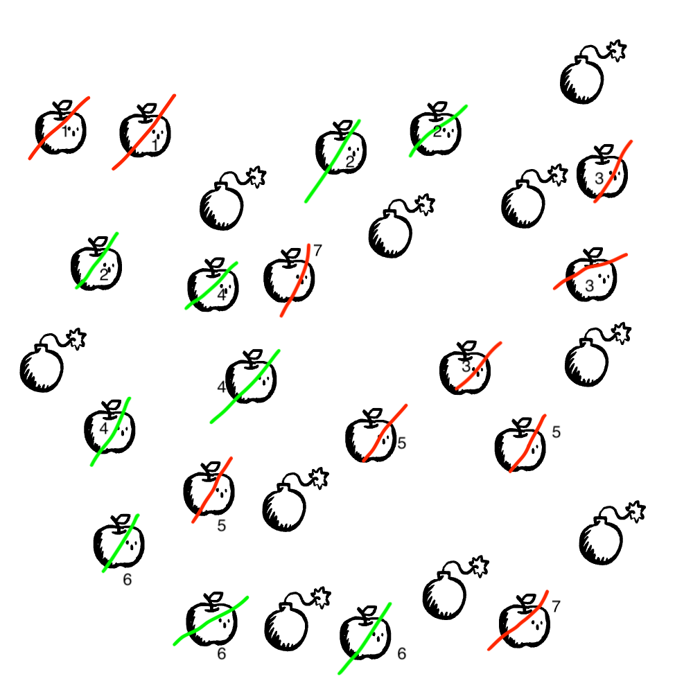

# Apples & Bombs

"Apples and Bombs" is a paper & pen game we've created, inspired by the game of [Nim](https://en.wikipedia.org/wiki/Nim). In theory, our game is equivalent to a simplified version of the game of Nim with only one pile of objects. We introduce a visual element where apples and bombs look quite similar, and their positions, when drawn using our app, are randomized. To win the game, you need both keen eyesight and mathematical skills.

## Board Setup

Randomly draw some apples (around 30) and bombs (around 10) on a piece of paper, ensuring that they do not overlap. Apples and bombs should look similar. Our app can conveniently generate this setup randomly.

## Basic Rules

1. Players set a range of apples to cut each round, like 1 to 3.
2. Players take turns cutting the apple.
3. If a player cuts the bomb or runs out of apples, they lose the game.
## Detailed Rules

### Number of Apples to Cut

Players can negotiate the minimum and maximum number of apples to cut each time, with the default recommendation being a minimum of 1 and a maximum of 3.

### Cutting Apples

Players take turns cutting apples, which means using a pen to mark a certain number of apples within the specified range. They must not cut fewer or more apples than allowed. For instance, in the image below, players are required to cut 1 to 3 apples per turn. The red marks represent Player 1, the green marks represent Player 2, and the numbers indicate the rounds.

### Determining the Winner

There are two situations in which a player can lose the game:

1. The player accidentally cuts a bomb.
2. When it's the player's turn, there aren't a sufficient number of apples left to cut.

In the game depicted in the image above, after Player 1 cuts 3 apples in their 7th turn, Player 2 has no more apples to cut. Therefore, Player 1 wins the game.