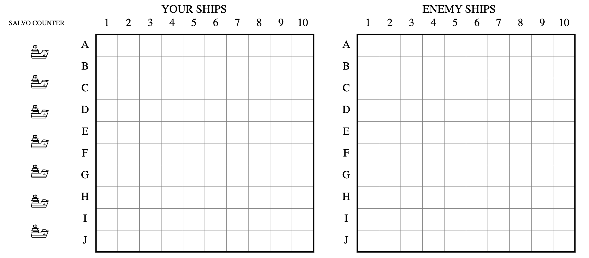

# Battleships

Battleship, originated in the early 20th century, is a strategic tabletop game designed to simulate naval warfare. The game typically involves two players, each placing different types of ships, such as cruisers, destroyers, submarines, and battleships, on their own game board. They then attempt to sink their opponent's fleet by guessing the positions of their ships. Players take turns marking coordinates to target and confirm hits based on their opponent's feedback. The objective of the game is to destroy all of the opponent's ships. Battleship combines strategy, logic, and guesswork, cultivating players' thinking skills and tactical reasoning, providing an engaging and challenging gaming experience. This classic game remains popular today and is commonly played in family entertainment and competitive tournaments.

Battleship can be played with a physical game board or with pen and paper. Let me introduce the game board and rules we have designed.
## Game Board Introduction
There are two parallel 10x10 game boards. The left board, labeled "YOUR SHIPS," is used for placing and recording your own ships as well as tracking hits from the opponent. On the left side of this board, there is a ship counter to keep track of how many ships you have remaining. The right board, labeled "ENEMY SHIPS," is used to record hits on the opponent's ships. The coordinates on the board, from 1 to 10 and A to J, determine the positions of the grid squares. Our app can randomly generate ships on the "YOUR SHIPS" board.

## Rules
### Ship Placement
Typically, we would print two game sheets, one for each player, and each player would deploy their ships on their own "YOUR SHIPS" grid. Different ships have different sizes and quantities. An example layout is shown in the image below：

The sizes and quantities of ships can be adjusted through mutual agreement.
### Gameplay Process
1. Players take turns guessing the positions of their opponent's ships. They mark coordinates on the opponent's grid, such as A5 or C6, to target and guess if there are ships present. After a hit, the player marks it as "hit," otherwise it is marked as "miss." The number of shots fired each turn can be one or more, equal to the remaining number of ships.
2. The opponent provides the result of the shots. If a ship is hit, the opponent must declare which type of ship was hit, and the player marks the hit position on the "ENEMY SHIPS" grid (usually with an X). If there is no hit, the opponent declares "miss," and the player marks it on the "ENEMY SHIPS" grid for further analysis (usually with a /).
### Victory Conditions
Players take turns attempting to sink each other's ships until one player successfully sinks all of their opponent's ships. The player who achieves this goal first wins.

## Reference Links
For more information related to Battleship, you can refer to:
- [Battleship (game) - Wikipedia](https://en.wikipedia.org/wiki/Battleship_(game))
