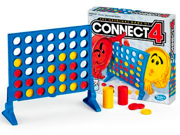
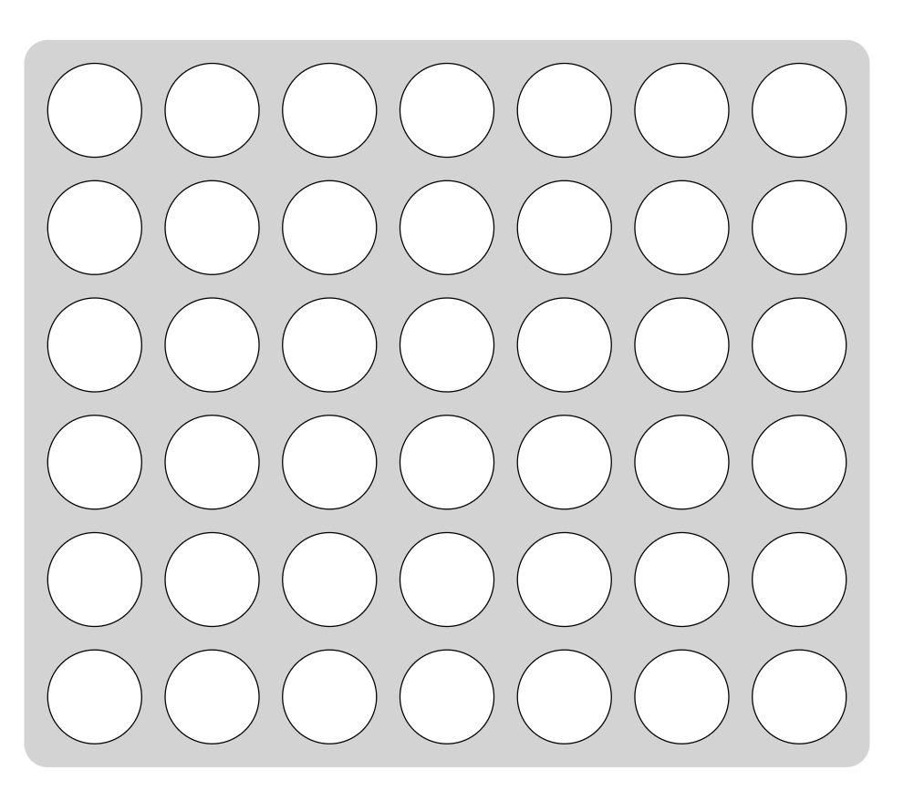
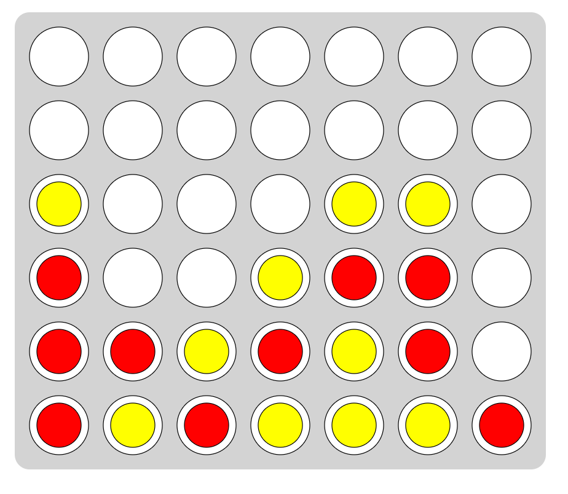

# Connect Four

"Connect Four" is an ancient and strategic board game that originated in 1974 and was invented by the American Howard Wexler. It consists of a vertical rectangular box with seven compartments inside, each equipped with an opening for pieces to fall into. The board has six rows and seven columns, totaling forty-two circular holes for players to observe piece positions. The game pieces are flat and round, slightly larger in diameter than the holes, and are differentiated by red and yellow colors, with twenty-one pieces of each color.

The gameplay of Connect Four is quite simple. Players take turns inserting one of their pieces into an opening, allowing it to fall to the bottom or on top of other pieces due to gravity. The objective is to be the first to connect four pieces of the same color in a horizontal, vertical, or diagonal line, resulting in a win. If the board is filled, and no one has achieved four in a row, the game ends in a draw.

Connect Four can be played using pen and paper, with printable sheets generated through the app for convenience.
## Game Board
The game board consists of a grid of 7x6 empty circles, as shown below:

## Gameplay Process

1. Players use pens of different colors to simulate the physical dropping of pieces onto the board. They draw circles in positions that meet one of the following rules:
    1. The bottom-most row of the board.
    2. One position directly above an existing piece.
2. The goal is to connect one's own pieces in a horizontal, vertical, or diagonal line.
### Determining the Winner

1. The player who first connects four of their pieces in a horizontal, vertical, or diagonal line wins.
2. If the board is filled, and no player has connected four pieces in a row, the game ends in a draw.

As shown in the image below, the yellow player has won the game:

## Reference Links
For more information about Connect Four, you can refer to [Connect Four - Wikipedia](https://en.wikipedia.org/wiki/Connect_Four).