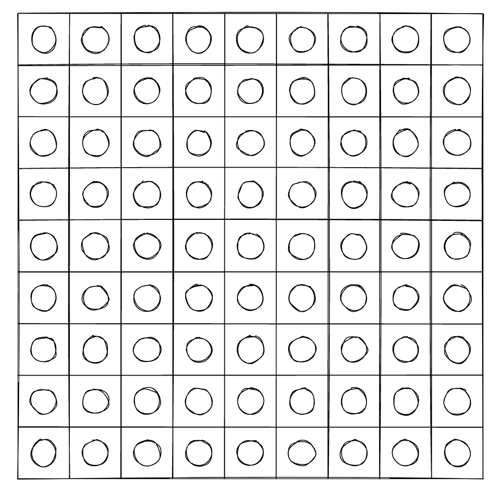
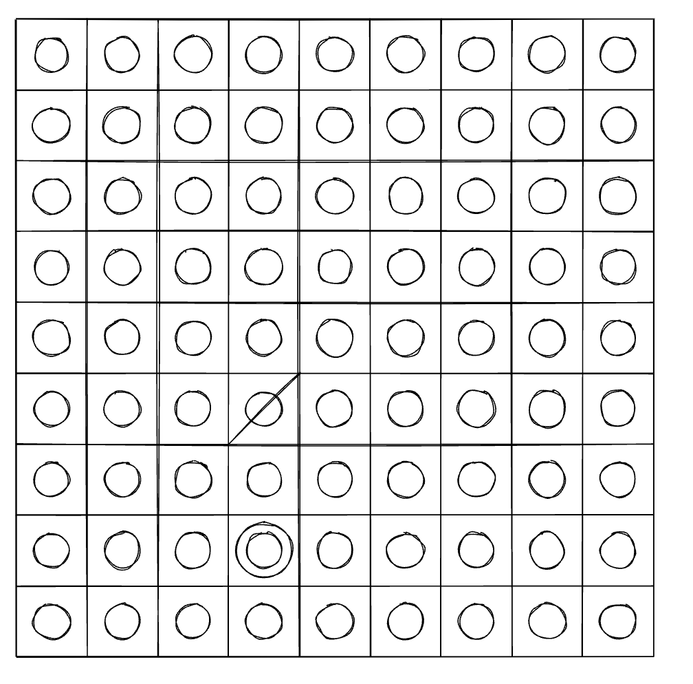
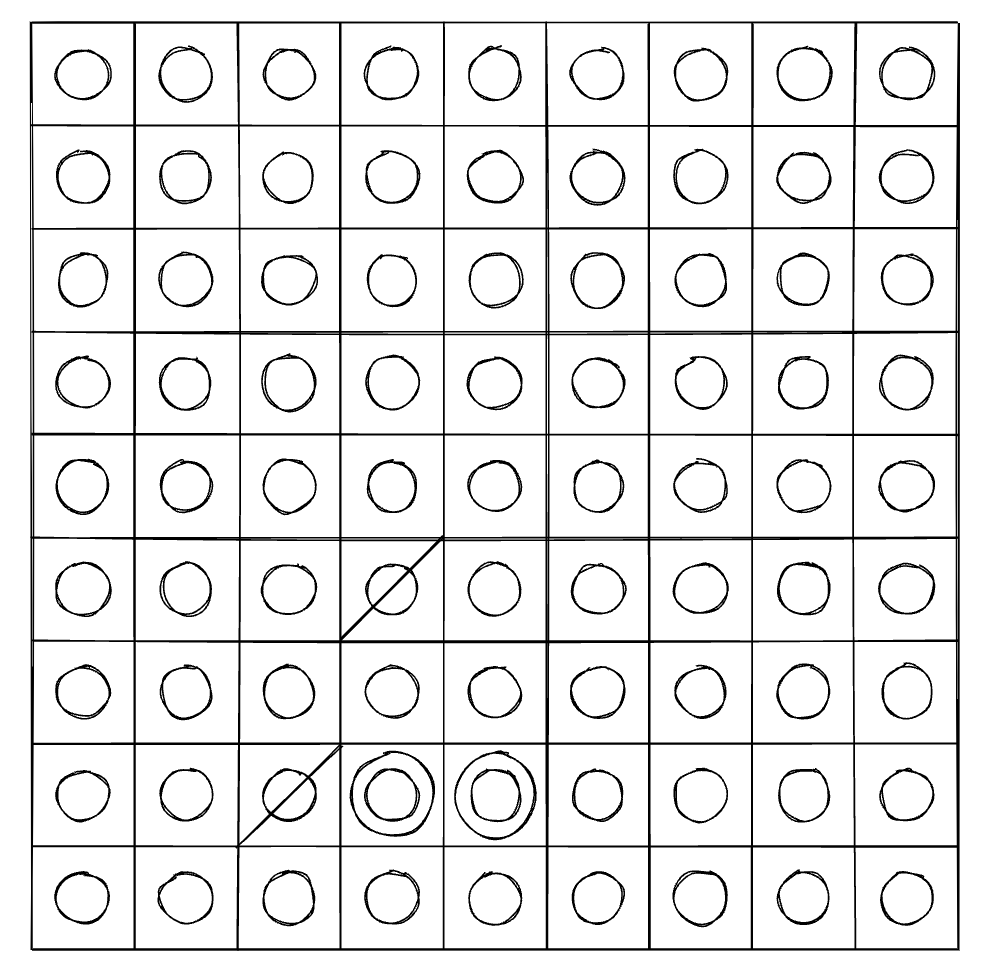

# Double Ring 

Double Ring Chess is a simple and intriguing game. The board consists of a 9x9 grid, with each cell containing a circular ring. Players must move the rings according to the rules to form a double ring, and they lose the game if they are unable to make a valid move. The game can be simulated using pen and paper, and our app can quickly draw the initial state of the board.

## Board Setup

Use a 9x9 grid as the game board and draw a smaller circular ring in the center of each cell.

## Short Rules
1. Players draw a / on a single ring to indicate moving that ring.
2. A single ring can be moved horizontally or vertically by passing through two rings (either two single rings or one double ring) and being drawn on another single ring.
3. Players take turns moving single rings,  if a player is unable to move according to the rules, they lose the game.

## Complete Rules
### Moves
Players take turns making moves using the "Skip Two Overlap" rule. The specific steps are as follows: Draw a diagonal line on the single ring that will be moved to indicate that it has left its original position. Then, skip over two rings (in a vertical or horizontal direction, diagonal moves are not allowed) and draw a larger circular ring outside the target ring (the fourth ring), creating a double ring. This represents the overlapping of the two rings. The original position of the single ring is considered an empty cell, and the double ring counts as two rings. "Skip Two Overlap" allows for skipping over either two single rings or one double ring.

### Endgame and Winning
The game ends when a player is unable to make a move according to the "Skip Two Overlap" rule. In this case, the other player is declared the winner.

## Variations in Rules
Players can agree to implement additional rules to add variety to the game. For example, the game board can be expanded, and the movement of the rings can be adapted accordingly. The "Skip Two Overlap" rule can be modified to "Skip Three Overlap," "Skip Odd Overlap" (skipping any odd number of rings), "Skip Even Overlap" (skipping any even number of rings), or "Knight's Overlap" (similar to the knight's move in chess), and so on. Different rule variations can increase the complexity and enjoyment of the game.