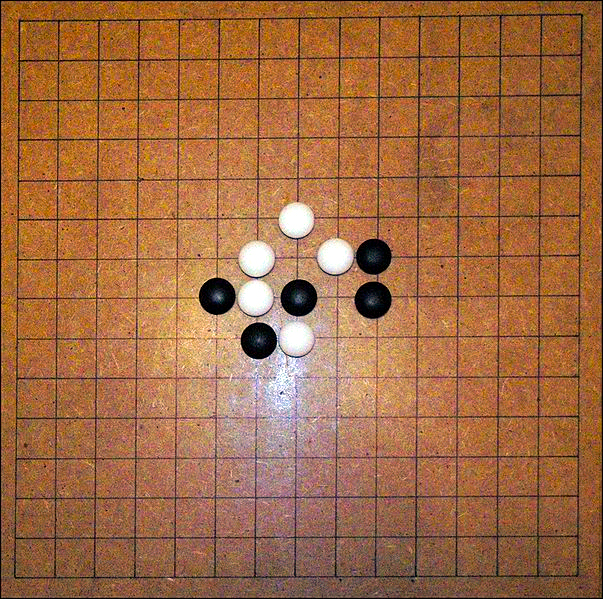
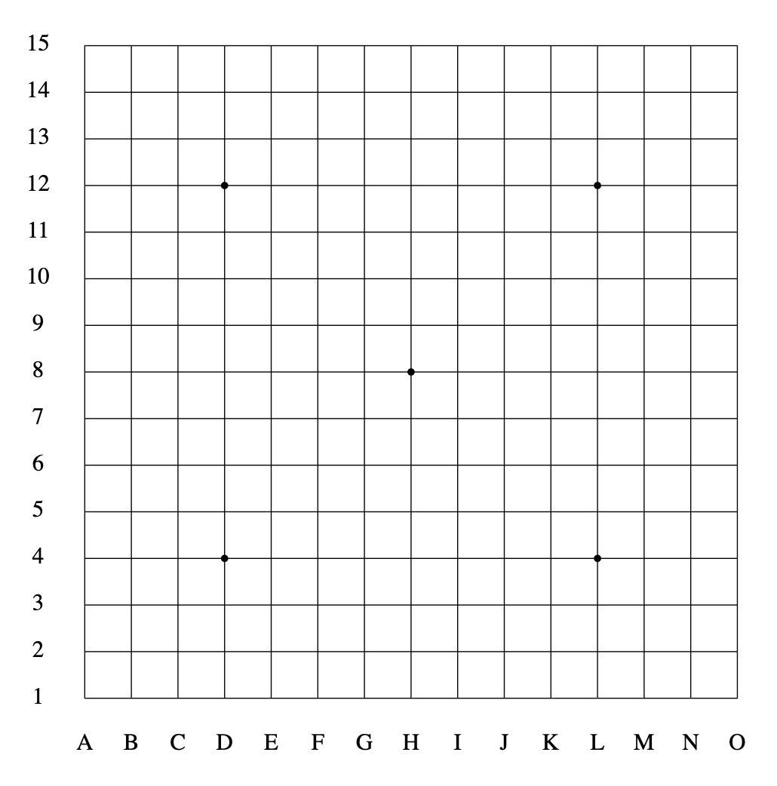

# Gomoku
Gomoku, also known as Five in a Row, is an ancient and classic strategy board game typically played on a 15x15 board. Two players take turns placing black and white stones, with the goal of achieving five stones in a row horizontally, vertically, or diagonally. Despite its seemingly simple rules, Gomoku involves profound tactics and strategies, earning it the title of "mind sport." It cultivates thinking, planning, prediction, competitiveness, and creativity. Gomoku is popular globally, with numerous variations and competition rules, making it an enjoyable and intellectually challenging board game suitable for all ages.

In its most basic form, Gomoku has no complex rules or restrictions, with the sole objective being to achieve five stones in a row. Under these rules, the player who goes first enjoys a significant advantage. Therefore, modern competitive Gomoku rules typically introduce more intricate balance rules, such as swapping the order of play between black and white or implementing restrictions. Beginners can start by learning the rules without restrictions.

## Game Board

- The game board is commonly made of wood or stone, although paper and pen games are also used. Gomoku is primarily played on a 15x15 board, occasionally using a 17x17 board, while unrestricted rules mainly employ 15x15 and 19x19 boards. The board is roughly rectangular, featuring five marked star points. The central star point is called the "hoshi" or "tengen."
    
- The vertical lines on the 15x15 board are labeled from left to right with the English letters A to O, and the horizontal lines are numbered from bottom to top with digits 1 to 15, facilitating the recording of game moves. In addition to the central hoshi, there are marked star points at D4, D12, L4, and L12 coordinates.
    
- The game pieces are typically made of stone, porcelain, or plastic, and come in two colors: black and white, similar to Go pieces.

## Original Rules

1. Game Board: Use a 15x15 square grid board.
2. Opponents: Two players participate, one using black stones, and the other using white stones.
3. Turn Sequence: Players take turns making moves, with one player placing their own color stone, followed by the other player taking their turn, alternating between black and white.
4. Move Rules: The objective for each player is to be the first to form a continuous line of five of their own stones either horizontally, vertically, or diagonally, known as "five in a row." When this occurs, the game ends, and the victorious player declares the win. If the board is filled, but no five-in-a-row has been achieved, the game results in a draw.
5. Restriction Rules: The original Gomoku rules do not include any restrictions, allowing players to make moves freely.
6. Opening Placement: At the start of the game, players can freely select any vacant space on the board to place their stones.

## Reference Link

For additional information on competitive Gomoku rules or restriction rules, please refer to [Gomoku - Wikipedia](https://en.wikipedia.org/wiki/Gomoku).
