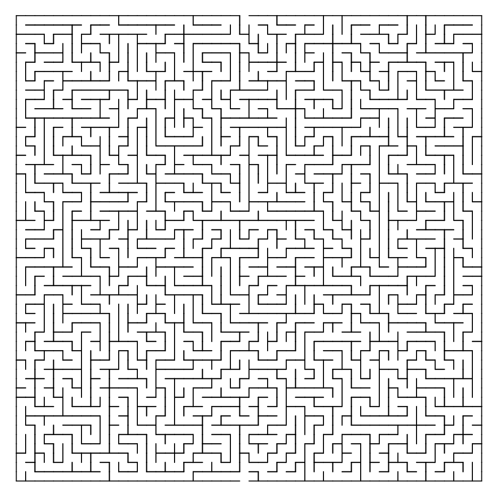
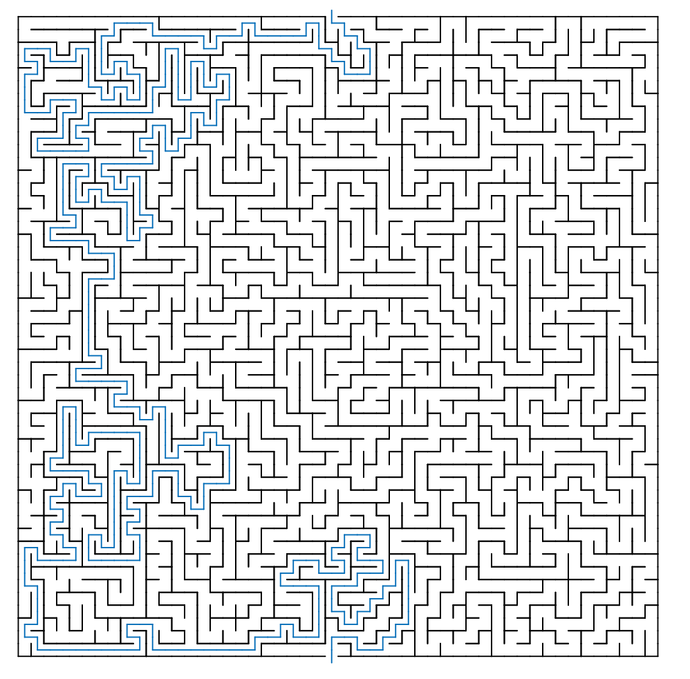
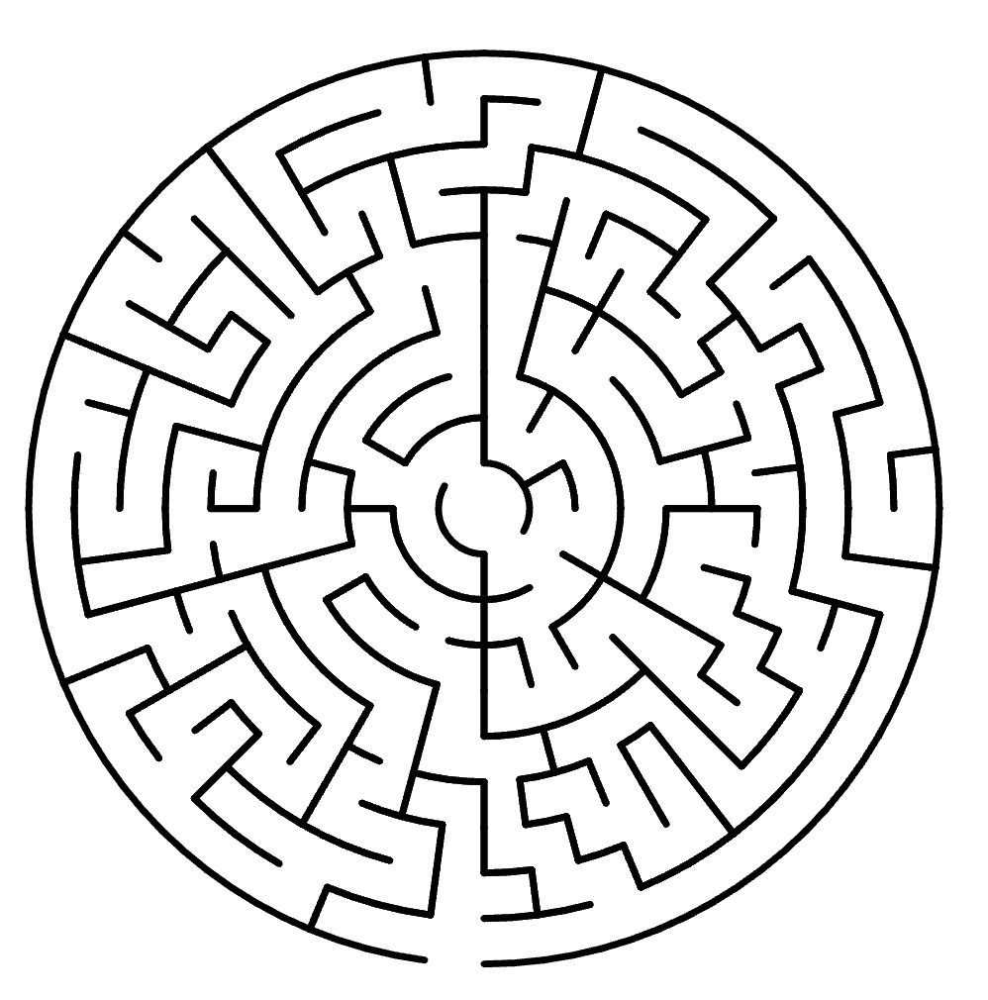
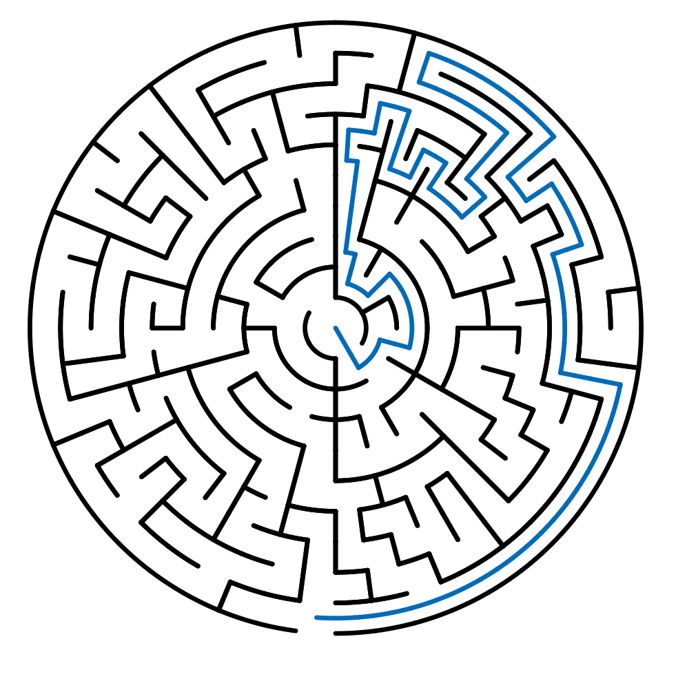

# Maze
Paper mazes represent a classic form of maze gaming, offering challenges through paper maps or maze boards. The history of this gaming style dates back to ancient times, with mazes existing in ancient Egypt and Greece.

Paper mazes are typically presented in a planar format, requiring players to find the correct path from the entrance to the exit within the maze's passages. Paths in the maze can be intricate and winding, demanding players to employ observation and logical thinking to navigate.

Various game pieces can be used for paper mazes. A common form is the maze board, where the maze pattern is engraved on wooden or plastic boards, and players use small balls or magnetic pieces to navigate the maze. Other forms include maze books and maze cards.

Playing paper mazes is straightforward; players only need a pen, pencil, or fingertip to trace the path and find the correct route to the exit. Paper mazes can offer challenges at multiple difficulty levels, ranging from simple beginner mazes to complex advanced ones.

Paper maze games not only provide entertainment and challenges but also cultivate spatial awareness, logical thinking, and problem-solving skills. They offer an independent, offline form of entertainment suitable for any time and place.

Our maze game on paper is designed to feature different maze shapes and difficulty levels based on various sizes.

As shown in the images below, the first is a larger-sized square maze.

The following image illustrates its solution.

The second image shows a smaller-sized circular maze.

The subsequent image displays its solution.
