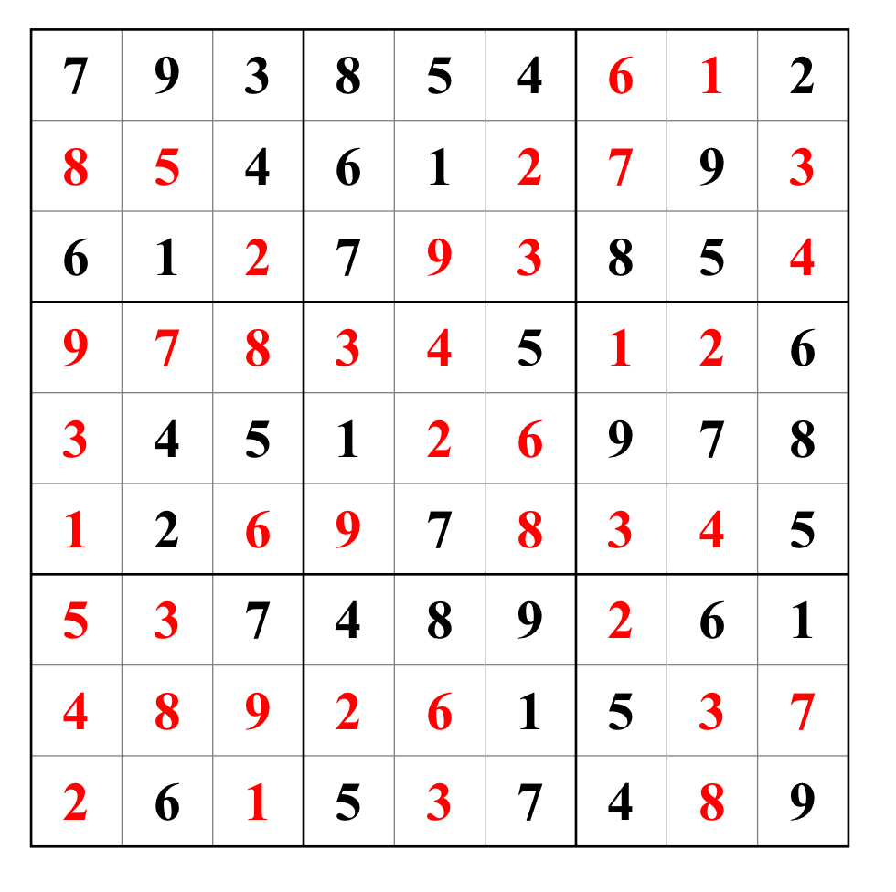

# Sudoku

Sudoku is a popular logic and mathematical puzzle game that aims to fill a 9x9 grid with numbers, ensuring that each row, column, and 3x3 subgrid contains unique numbers. This game originated in 18th-century Switzerland but gained widespread popularity in 1970s Japan.

The gameplay of Sudoku is simple yet challenging. Players start with a partially filled Sudoku grid, and the task is to deduce, use logic, and make inferences to fill in the remaining numbers. Players must adhere to the rules of Sudoku and employ strategies and reasoning to correctly fill the grid until it is entirely filled.

Sudoku is not just a casual pastime; it is also a mathematical puzzle. Solving a Sudoku puzzle requires the application of mathematical logic and reasoning. Sudoku puzzles come in varying levels of difficulty, from easy to hard, and they help exercise the brain's flexibility, attention, and problem-solving abilities.

Our Sudoku print paper is designed with a balance of convenience for filling in numbers and paper-saving, with two Sudoku puzzles on each page. We also provide QR codes below each question. By using the QR code scanning feature in the "Me" page of the app, you can access the corresponding answers to the questions.

Here is an example of a simple Sudoku puzzle:

Its solution is shown in the following image:

## Short Rules
1. Fill in the grid with numbers from 1 to 9.
2. Ensuring that each row, column, and smaller 3x3 grid, contains all the numbers only once.
3. You can scan the QR code to check the answer.
## Full Rules
1. The Sudoku game uses a 9x9 square grid divided into 9 smaller 3x3 subgrids.
2. At the beginning of the game, some squares already have numbers filled in, and players must use the numbers 1 to 9 to fill in the remaining blank squares.
3. In each row, column, and 3x3 subgrid, the numbers 1 to 9 must be unique and not repeated.
4. Players use reasoning and logic to determine the correct numbers. Based on the numbers already filled in and the rules of Sudoku, players can gradually fill in the remaining squares.
5. The objective of solving Sudoku is to fill the entire 9x9 grid in such a way that each row, column, and 3x3 subgrid contains unique numbers.
## Reference Links
For more information and techniques related to Sudoku, you can refer to:
- [Sudoku - Wikipedia](https://en.wikipedia.org/wiki/Sudoku)
- [Sudoku Rules - Strategies, solving techniques and tricks](https://sudoku.com/sudoku-rules/)