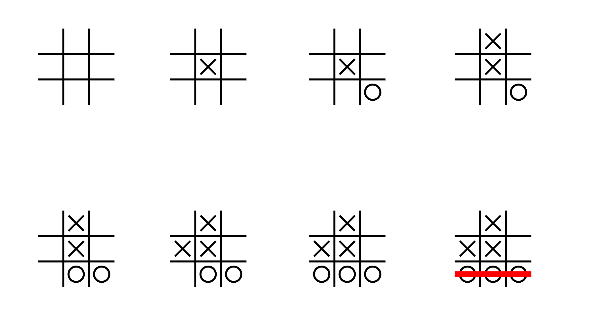

# Tic Toe Toc
Tic-tac-toe, also known as Noughts and Crosses, is a classic strategic board game. Its origins can be traced back to ancient civilizations, and today it has become a popular game worldwide. It is particularly suitable for teaching children logical thinking. Due to its relatively small game board, the optimal solution for Tic-tac-toe is well-known. When both players adopt the best strategies, the game ends in a draw.

## Board Setup
The Tic-tac-toe board can be represented using a 3x3 grid or, in a simpler form, by drawing four lines to create a symbol resembling `#`.
## Short Rules
1. Two players take turns placing X or O in empty cells.
2. Achieve a line of three marks horizontally, vertically, or diagonally.
## Full Rules
1. At the start of the game, the board is empty, and two players take turns. One player uses circles (O) as their mark, while the other player uses crosses (X) as their mark.
2. In each player's turn, they can choose to place their mark in any empty square on the board. When it's the next player's turn, they select another empty square to mark. Once a mark is placed on a square, it cannot be changed or moved.
3. The goal of the players is to win by forming three of their marks in a row horizontally, vertically, or diagonally. If a player successfully forms three of their marks on any straight line, they win the game.
4. If all the squares on the board are filled with marks, but no player has completed a row of three marks, the game ends in a draw.
5. If, during the game, one player has already formed three of their marks and won, or it's clear that no other player can form three marks, the game can end prematurely without further play.

The diagram below illustrates a game of Tic-tac-toe:

