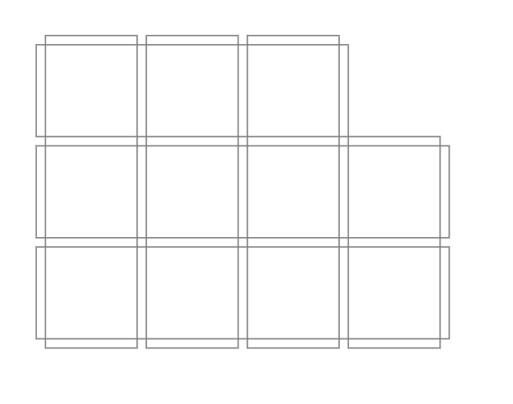
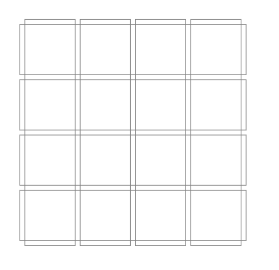
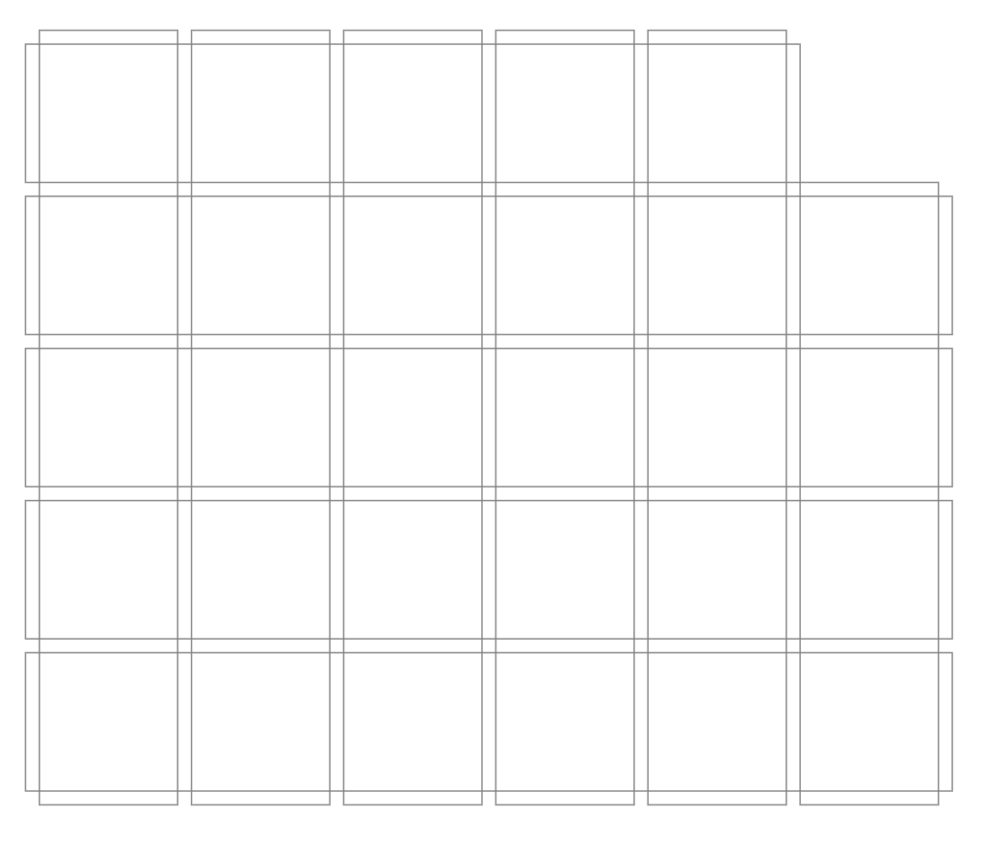
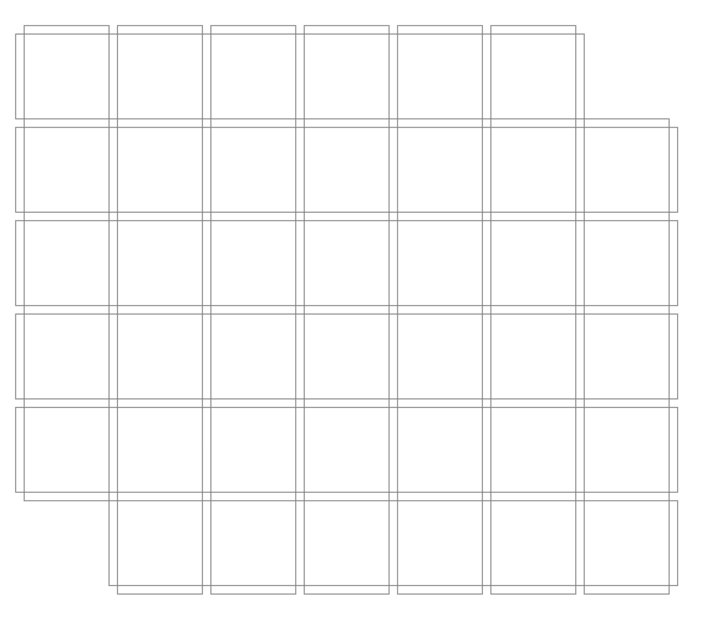
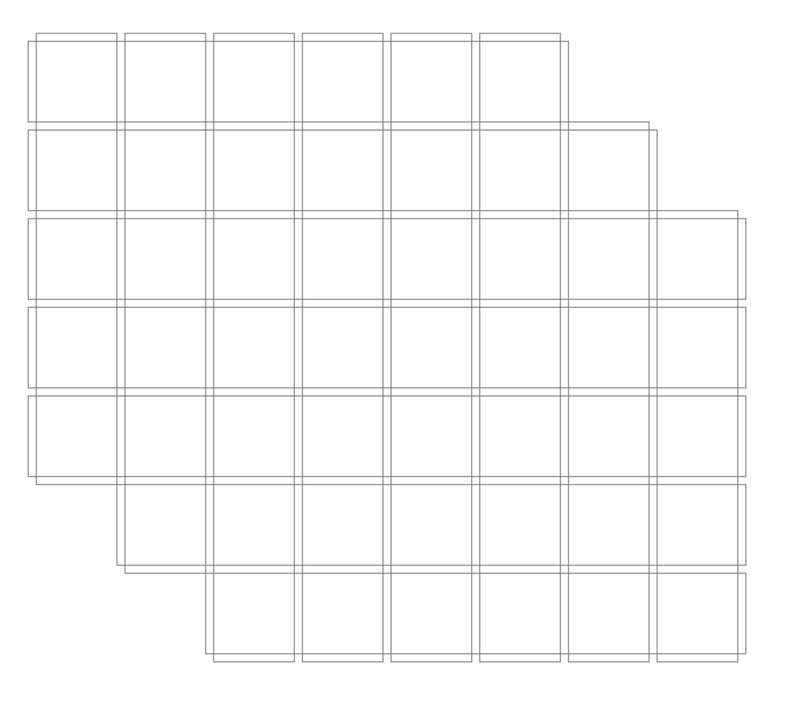
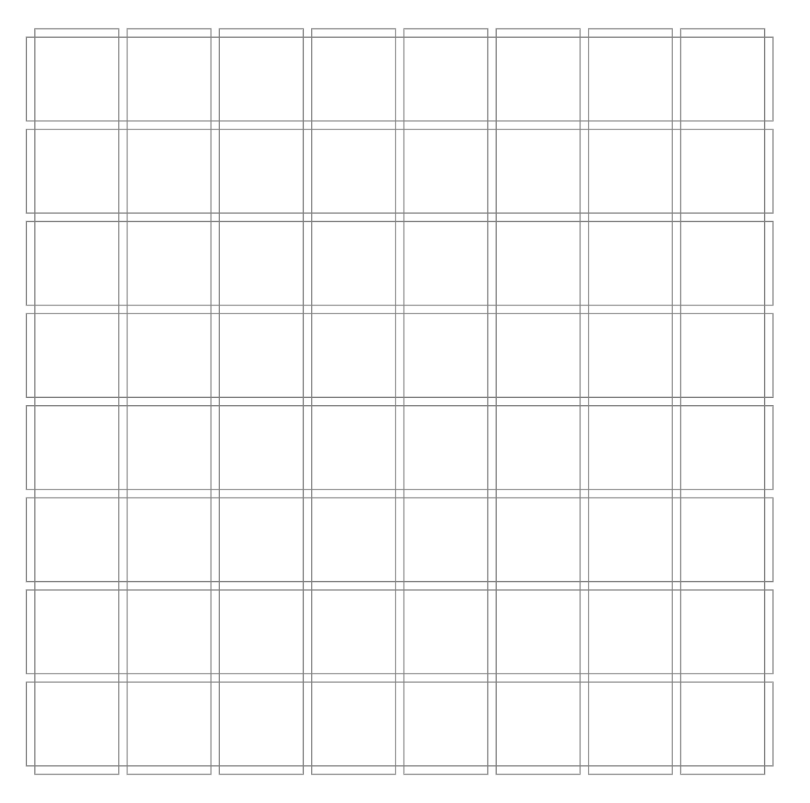
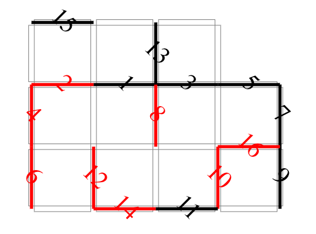
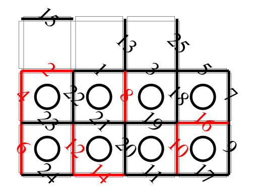

# Tree Planting
Tree Planting Chess is a type of board game that was once popular in the Beijing region of China. The gameplay of Tree Planting Chess simulates the process of afforestation. The way pieces are placed in Tree Planting Chess is quite unique; unlike conventional board games where pieces are positioned in the center of squares (e.g., chess) or at the intersections of lines (e.g., Go), in Tree Planting Chess, pieces are placed along the edges of the squares.

In the classic version of Tree Planting Chess, there are a total of 11 squares with 29 segments available for placing pieces.

The physical version of Tree Planting Chess is typically made from hard plastic. Each chess square is designed with a concave groove measuring 40 millimeters in length, 4 millimeters in width, and 2 millimeters in depth to accommodate the elongated rectangular pieces, which measure 39 millimeters in length, 4 millimeters in width, and 6 millimeters in height. Each square also has a small circular hole in the center for inserting tree-shaped pieces.

Tree Planting Chess can also be played using pen and paper to simulate the game. The rules described below are based on the pen-and-paper version.

## Drawing the Game Board

 As shown in the images below, draw a certain number of squares on the paper. Common grid sizes include 11, 16, 29, 40, 50, 64, etc. The edges of the squares can be drawn with a certain width, or you can simply use lines without width to represent them.

## Basic Rules

1. Players take turns drawing the edges of the squares.
2. If a player completes the fourth edge of one or two squares, they plant a tree (X or O) on those squares and then draw another edge.
3. The player who plants the most trees wins.

## Complete Rules

### Setup (Preparing to Plant Trees)

At the beginning of the game, there are no pieces on the board. After the game starts, both players take turns placing pieces, which means drawing an edge along one of the squares. Players can use pens of the same color or different colors, as long as the drawn edges are clearly distinguishable. This process simulates the preparation of land with four edges for tree planting.

### Scoring (Planting Trees)

1. As the setup phase continues, some squares will have three edges drawn around them. If it's a player's turn to complete the fourth edge, they create a tree pit, and they plant a tree (which can be represented by O and X or drawn in a shape or color of their choice) in that tree pit.

2. After a player scores by planting a tree, they must draw another edge. If this creates a new tree pit, they can plant another tree, and so on until no new tree pits can be formed, but they must still draw one more edge.

3. If one edge is drawn between adjacent squares, creating two tree pits, a tree is planted in each tree pit, and then one more edge is drawn (only one).

### Determining the Winner

When all available edge positions have been drawn, and all squares have trees, the game ends. The player with the most trees planted wins. For example, in an 11-square game, the scores could be 6:5, 7:4, or even 11:0.